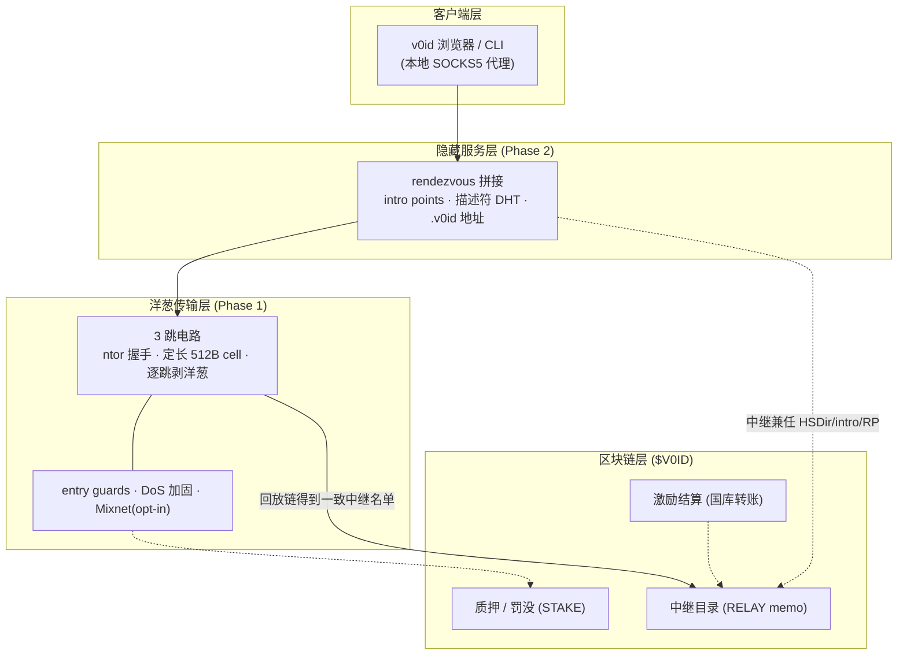
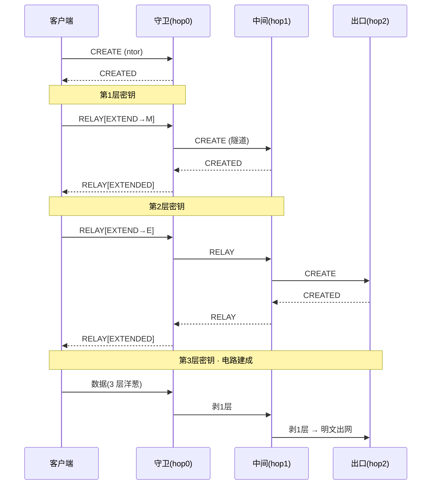
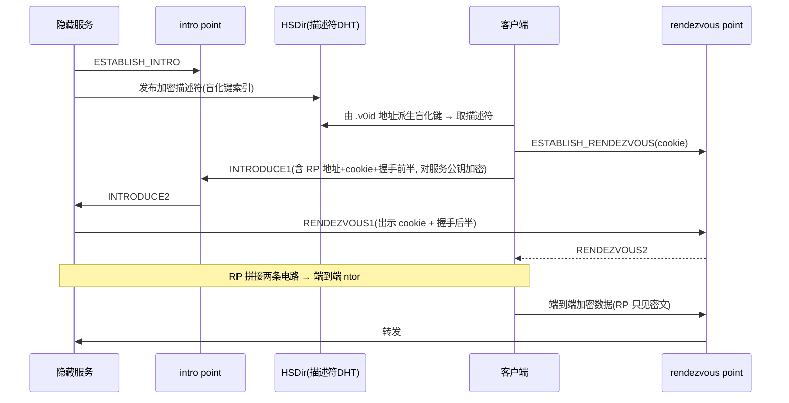
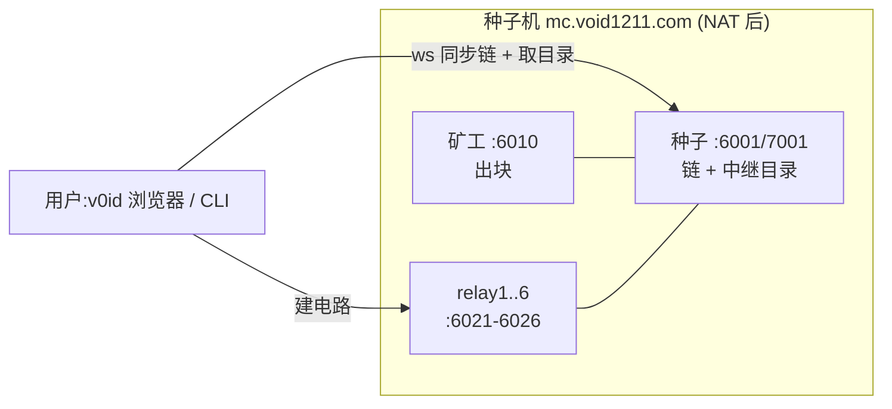

# v0idnet 架构与原理

> `.v0id` 洋葱匿名网络的**架构总览**——把威胁模型、洋葱路由、隐藏服务、激励、部署串成一张图。
> 细节规范见 [HS-PROTOCOL.md](HS-PROTOCOL.md)(隐藏服务协议)、[INCENTIVE-PROTOCOL.md](INCENTIVE-PROTOCOL.md)(激励);上手见 [README.md](README.md)。

v0idnet 是一个**类 Tor 的洋葱匿名网络**,跑在 v0idChain 区块链上。访客与服务器经多跳加密电路通信,`.v0id` 隐藏服务让**收发双方互不知 IP**。区块链不参与匿名传输本身(那会泄漏 + 拖慢),只干它擅长的:当**去中心化的中继目录**、抗女巫的**质押**、以及可选的**激励结算**。

---

## §1 分层架构

**要点**:匿名边界全在**链下**(电路 / rendezvous / 内容);链只提供**全网一致的视图**(谁是中继、谁质押了)。这正是 v0idnet 真正打赢 Tor 的一点——用区块链回放代替 Tor 的 9 个目录权威。

---

## §2 威胁模型(先写,不可省)

**保护对象**:客户端(读者)与服务端(发布者)的网络身份(IP),对**彼此**、对**中继**都隐藏。

| | 防 | 不防(诚实声明) |
|---|---|---|
| **v1 洋葱** | 运行部分中继的主动对手 · 单端本地 ISP · 读取公开链的对手 | **全局被动对手的端到端流量/时序关联**(低延迟洋葱的固有局限,Mixnet 缓解) |
| **始终** | — | 应用层去匿名(JS/浏览器指纹/内容回连)· 端点被攻陷 · $V0ID 资金图谱自我去匿名 |

> **匿名集诚实声明**:匿名性上限 = 诚实中继数 × 活跃用户数。**网络小 = 匿名弱**,与密码学无关。绝不用「军用级加密」话术掩盖。

---

## §3 区块链的正确分工

对匿名**传输本身**,区块链有害(延迟 + 公开账本)。它只在四件事上值钱(同 Nym / Lokinet 的分工):

| 职责 | 放哪 | 为什么 |
|---|---|---|
| 中继目录 | **链上** `RELAY\|` | 回放链即得一致网络视图——替代 Tor 目录权威 |
| 质押 / slashing | **链上** `STAKE\|` | 抗女巫;失职中继被扣押金(见 [INCENTIVE-PROTOCOL](INCENTIVE-PROTOCOL.md)) |
| 激励结算 | **链上(极少)** | 仅结算,**不**按电路上链 |
| 服务描述符 | **链下 DHT** | 上链 = 全网永久可枚举所有 `.v0id` 地址,必须链下(这是 Tor v3 让地址不可枚举的机制) |
| 电路 / rendezvous / 内容 | **链下** | 低延迟,隐私边界全在网络内 |

---

## §4 洋葱传输:3 跳电路

每跳用 **ntor 握手**(x25519 ECDH + 前向保密 + 单向认证中继),报文是**定长 512B cell**(永不变长,为 Mixnet 预留),客户端为每跳**逐层加密**,只有出口能读明文。电路用 Tor 式 **telescoping** 逐跳延伸。

**每跳可见性**:守卫只见客户端 IP;中间两端都不见;出口只见目标。**没有任何一跳同时知道两端 + 完整路径**。详见 [HS-PROTOCOL §6–8](HS-PROTOCOL.md)。

**加固**:
- **Entry guards**:把所有电路第一跳钉死在一小撮持久守卫上(慢轮换),抗「迟早某条电路入口是对手」的统计去匿名。
- **DoS**:电路 TTL/空闲清扫 · 每电路 cell 限速 · EXTEND 连接超时 · 按连接 + 按源 IP 电路上限。
- **Mixnet(opt-in)**:逐跳指数延迟 + `CMD_DROP` cover 流量 + RFC6479 滑窗防重放(让重排与流式兼容),更抗流量分析。默认关、零回归。

---

## §5 隐藏服务:双向 rendezvous

`.v0id` 地址 = `base32(ed25519 公钥 + 校验 + 版本)`,**自认证、不上链**(知道地址才查得到、枚举不出)。服务把 intro points 写进**加密描述符**、签名后发到中继间的**描述符 DHT**,索引键由地址 + 当前时间片**盲化**派生(跨周期不可关联)。

客户端与服务各建一条 3 跳电路到同一个 **rendezvous point(RP)**,RP 把两条电路拼起来 → **3+3 跳双向匿名信道**:两端互不知 IP,RP / intro 也不知两端。内容直接经此信道吐字节,**不走 IPFS / 外部 DHT announce**。详见 [HS-PROTOCOL §13–16](HS-PROTOCOL.md)。

---

## §6 激励层(让「有人愿意跑中继」成立)

冷启动 → 抗女巫 → 激励质量 → 角色风险差异 → 可持续。**诚实底线**:链看不到中继的真实工作,故 v1 选**可信测量方**(中心化 bwauth,文档明写),终局是**客户端概率支付**(Orchid 式,密码学抗女巫)。

- **质押**(链上托管,复用红包状态机):`STAKE\|<role>` 锁押金,目录只纳入有质押的中继 → 抬高女巫成本。**软分叉激活高度 16000**。
- **可信测量方**:逐 epoch 穿过中继建测试电路探活性 → 签 attestation。
- **奖励**(国库出资、纯转账、零共识改动):按在线率 × 角色倍率 × 启动加成发;**v1 建好但默认不发**(国库有限)。
- **罚没**:只罚掉线(连续 N epoch),保守扣比例。

完整设计见 [INCENTIVE-PROTOCOL.md](INCENTIVE-PROTOCOL.md)。

---

## §7 部署拓扑(线上网络)

线上:种子 `ws://mc.void1211.com:6001` + 6 中继(`:6021-6026`,上链发布)+ 矿工持续出块。app 的 `seeds.js` 已内置种子 → 开箱即连。**真 3 跳电路已端到端验证。**

> **诚实拓扑限制**:目前 6 个中继**同处一台 NAT 后种子机**。单条电路 hairpin 没问题,但 HS rendezvous 需多条中继间电路并发,单路由器 NAT hairpin 撑不住嵌套 → **完整 `.v0id` 浏览需把中继分散到不同主机/IP**(真运营者多样性)。这是部署拓扑问题,不是代码缺陷。

---

## §8 诚实边界(客户端首屏须保留)

1. **匿名集小 = 弱匿名**:中继 + 用户越多越匿名,与密码学无关。
2. **不防**全局被动对手端到端关联(Mixnet 缓解)、应用层去匿名。
3. **激励 v1 中心化**(可信测量方)+ 有限国库引导池,真去中心化/抗女巫靠后续客户端付费。
4. **HS 浏览需中继分散到多主机**(见 §7)。
5. **clash 等系统代理**截断 `ws://` → 给 `mc.void1211.com` 加 DIRECT 直连规则。

---

## §9 先行者与署名

近乎重造 Lokinet,实现前必读:**Tor v3**(rendezvous/intro/盲化键/guards/bwauth)· **Nym/Loopix**(mixnet+代币+Sphinx)· **Orchid/HOPR**(概率支付)· **Sphinx**(定长包)· **Lokinet/Oxen**(链+洋葱+质押)· **I2P**(纯 P2P 对照)。各文件头按仓库 Attribution 纪律写明出处与许可。
